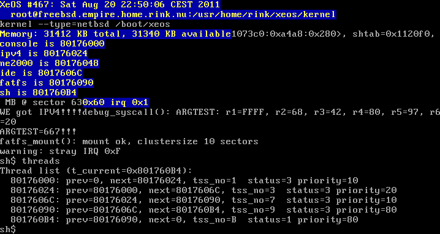

# XeOS

XeOS (pronounced as _chaos_) is my attempt to create a stable, solid microkernel. It was mostly for research and development purposes, and designed to be easy to understand, extend and generally, to play around with.

## Features
 
 * True pre-emptive multitasking
 * Microkernel architecture
 * Support for ELF executables
 * Tiny libc-like general library
 * Basic IPv4 functionality
 * NE2000 NIC support
 * IDE support
 * FAT16 support

## Screenshot

## Downloads

 * [Latest release](releases/xeos-20051009.tar.bz2), 2005-10-09 (1.3MB)
 * [Demonstration disk image](releases/xeos-20110820.img), 2011-08-20 (1.44MB) - note that this will not work in QEMU, Bochs is fine though
